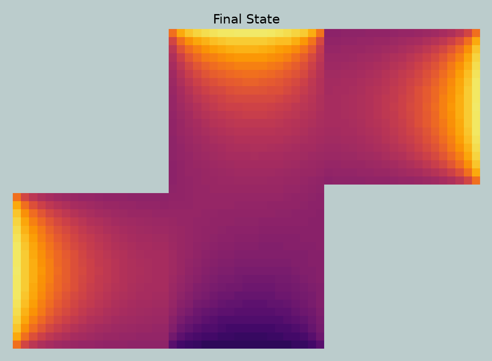
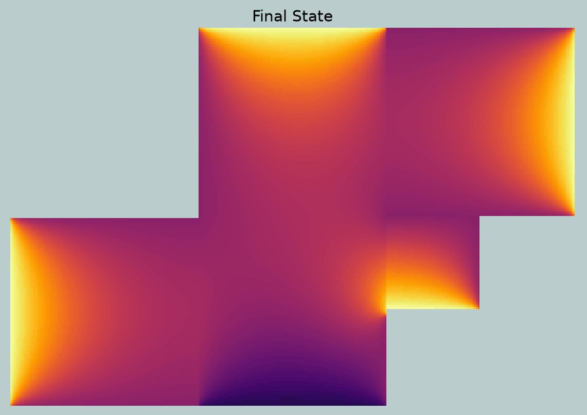
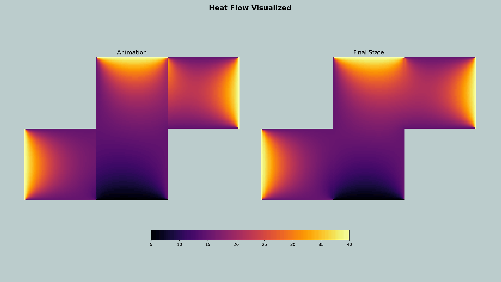
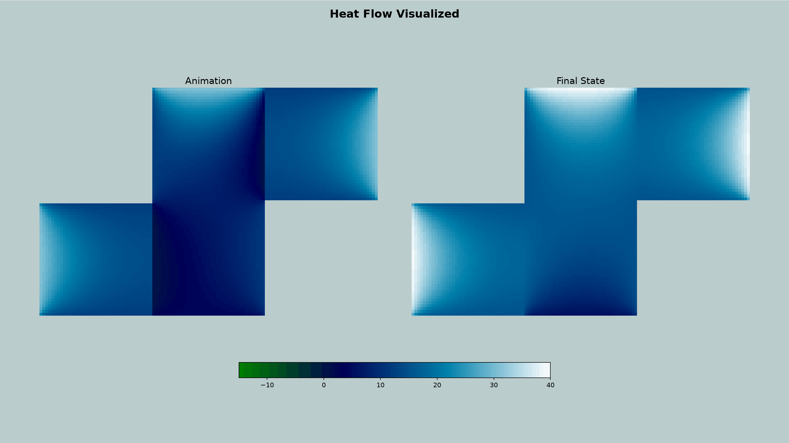

# Heat Simulation with OpenMPI - Course NUMN21

In this project we aim to model the temperature distribution in an apartment by
solving the heat equation. To speed up execution of this process, we use OpenMPI
to divide the initial floorplan into multiple rooms which can be solved simultaneously.

## Usage

To run the main file, you must have OpenMPI installed, and run the following:

```
mpiexec -n 3 python main.py
```

This runs main.py using mpiexec which should spin up three threads to handle
the computation. After a short delay, you should see a plot visualizing an
animation through the iterations of the program, and the final state it ended on.

Several aspects related to the plotting can be configured in main.py, for instance
the cmap can be changed to change the color mapping in the heatmaps, and the
animation can be toggled On/Off.

## Assignment Tasks

1. **Task 1:** Dirichlet-Neumann matrices when mesh width dx = 1 / 3

2. **Task 2:** Is heating in the flat accurate?

The heating looks fairly accurate, though the level of detail is limited with dx = 1 / 3.

3. **Task 3:** Plotted temperature distribution

Plot with a mesh width $dx = 1 / 20$:



4. **Task 4:** Varying parameters

    1. Adjusting iterations

    2. Adjusting dx
    
    3. Adjusting smoothing param

### Extension

1. **Task 1:** Dirichlet-Neumann matrices when mesh width dx = 1 / 3

2. **Task 2:** Is heating in the flat accurate?

3. **Task 3:** Plotted temperature distribution

Plot with a mesh width $dx = 1 / 100$:



4. **Task 4:** Varying parameters

    1. Adjusting iterations

    2. Adjusting dx
    
    3. Adjusting smoothing param

## Example Output

These two examples were created with the same initial conditions and
parameters, but demonstrate the different plotting schemes available.



Since the "ocean" theme includes green values at the low end, the minimum
was dropped for better visual clarity.



## Project Files

- **main.py** -	Project entrypoint
- **geometry.py** -	Defines rooms, their interfaces, and floorplan builders for plotting
- **matrix.py** - Construct the finite-difference matrices
- **room_solver.py** - Solve one room with given boundary conditions
- **dn_MPI.py** - Implement the Dirichlet-Neumann iteration and relaxation
- **mpi.py** - Provide MPI ranks and communication between rooms
- **plot.py** -	Plot the final temperature distribution

## Collaborator Efforts

- Lukas Nord
    - Implementation of finite difference matrix (matrix.py).
    - Main iteration for dirichlet neumann cycles (dn_MPI.py).
- Linn Preuss Jelvez
    - Implemented solver (room_solver.py).
    - Added room 4: room, interface, new floorplan.
    - Solved and plotted including room 4.      
- Orsolya Bosáková
    - Set up of the geometry of the three rooms (geometry.py)
    - Calculate the initial boundary conditions for the interfaces
- Scott Gibson
    - Plotting & Floorplan builder functions
    - Visual test file for plots
- Mennaallah Ali Abdellatif Mohamed Alashery

## Potential Flaws and Notes for Improvement

## TODO

- Add more unit test files
- Add Sphinx documentation support
- Add animation file save support to a constant
- General code cleanup, organization, and ensure naming convention is more convenient
- Convert from building room dimensions from dx, to building dx from room dimensions
